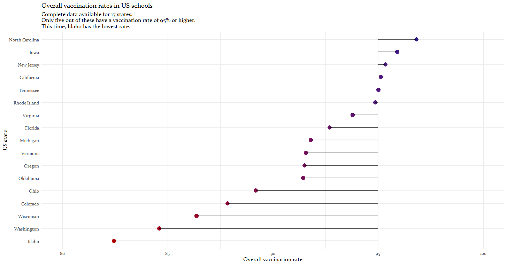
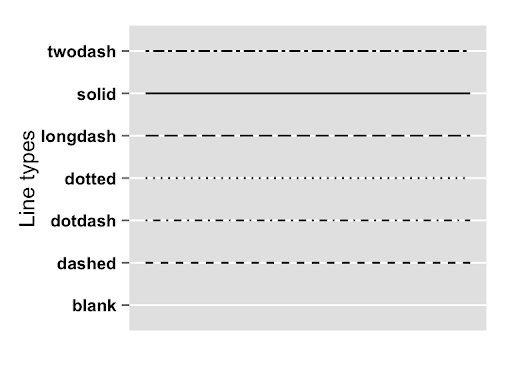

Lightning talk for [R-Ladies Freiburg's](https://www.meetup.com/rladies-freiburg/) December 2020 meetup ("This year I learned... and it changed my life!").

```{r global_options, include=FALSE}
knitr::opts_chunk$set(warning=FALSE, message=FALSE)
```

Inspiration for this (and many other plots I've made) courtesy of the [R Graph Gallery](https://www.r-graph-gallery.com/)

## What's a lollipop plot?
Here's an example:  


- similar to a bar plot, but:
  - consists of a line ("stem") and a dot at the top ("marker")
- variables to visualise:
  - one numeric
  - one categorical
  - plus optional additional variables (numeric or categorical)
- but consider that lollipop plots don't show dispersion measures (e.g. standard deviation)

## How do I make one of these?
- using ggplot (what else)
- but there's no separate geom for it
- instead, we'll combine 
  - geom_segments for the lines/stems
  - geom_point for the dots

## Data and packages
```{r data, message=FALSE, warning=FALSE}
chopped <- readr::read_tsv('https://raw.githubusercontent.com/rfordatascience/tidytuesday/master/data/2020/2020-08-25/chopped.tsv')

library(tidyverse)
library(viridis) # optional - for nice, colourblind-friendly colours
```

- this Tidy Tuesday dataset contains data on the cooking TV gameshow "Chopped"
- we'll visualise the IMDB episode rating in a lollipop plot
- more info on this data [here](https://github.com/rfordatascience/tidytuesday/blob/master/data/2020/2020-08-25/readme.md)

## A tiny bit of data prep
We need to convert season and series_episode to factors, and drop NAs.
```{r prep}
chopped <- chopped %>% 
  mutate(season = as_factor(season),
         series_episode = as_factor(series_episode)) %>% 
  drop_na(episode_rating)

head(chopped)
```

## First plot!
We'll only visualise ratings from the first four seasons in order to not clutter the graph.
```{r basic plot}
chopped %>% 
  filter(season %in% c("1", "2", "3", "4")) %>% 
  ggplot() +
  aes(x = series_episode, 
      y = episode_rating) +
  geom_point() + # dots
  geom_segment(aes(x = series_episode, xend = series_episode, # line drawn for each episode
                   y = 0, yend = episode_rating) # lines should start at 0 and end at the episode rating (i.e. connect with the dot)
               ) +
  theme_minimal() +
  labs(x = "Episode", 
       y = "IMDB rating",
       title = "'Chopped' ratings, first four seasons")
```

## Changing the baseline
Which episodes get ratings of 9 or higher?
```{r baseline}
chopped %>% 
  filter(season %in% c("1", "2", "3", "4")) %>% 
  ggplot() +
  aes(x = series_episode, 
      y = episode_rating) +
  geom_point() +
  geom_segment(aes(x = series_episode, xend = series_episode, 
                   y = 9, yend = episode_rating)
               ) +
  theme_minimal() +
  labs(x = "Episode", 
       y = "IMDB rating",
       title = "'Chopped' ratings, first four seasons")
```

Which episodes have above-average, which have below-average ratings?
```{r average}
chopped %>% 
  filter(season %in% c("1", "2", "3", "4")) %>% 
  ggplot() +
  aes(x = series_episode, 
      y = episode_rating) +
  geom_point() +
  geom_segment(aes(x = series_episode, xend = series_episode, 
                   y = mean(episode_rating), yend = episode_rating)
               ) +
  theme_minimal() +
  labs(x = "Episode", 
       y = "IMDB rating",
       title = "'Chopped' ratings, first four seasons")
```

## Reordering
Let's sort by rating instead of chronologically by episode using reorder. Adding a minus sorts in descending order, otherwise it'll sort in ascending order.
```{r reorder}
chopped %>% 
  filter(season %in% c("1", "2", "3", "4")) %>% 
  ggplot() +
  aes(x = reorder(series_episode, -episode_rating), 
      y = episode_rating) +
  geom_point() +
  geom_segment(aes(x = series_episode, xend = series_episode, 
                   y = mean(episode_rating), yend = episode_rating)
               ) +
  theme_minimal() +
  labs(x = "Episode", 
       y = "IMDB rating",
       title = "'Chopped' ratings, first four seasons")
```

## Labels
Let's use the name of the episode instead of the number. For longer labels, it often makes sense to flip the coordinate system by adding + coord_flip().
```{r coordinate system}
chopped %>% 
  filter(season %in% c("1", "2", "3", "4")) %>% 
  ggplot() +
  aes(x = reorder(episode_name, -episode_rating), 
      y = episode_rating) +
  geom_point() +
  geom_segment(aes(x = episode_name, xend = episode_name, 
                   y = mean(episode_rating), yend = episode_rating)
               ) +
  theme_minimal() +
  labs(x = "Episode", 
       y = "IMDB rating",
       title = "'Chopped' ratings, first four seasons") +
  coord_flip()
```

## Adding in colour
Let's colour-code the seasons:
```{r colourcoding categories}
chopped %>% 
  filter(season %in% c("1", "2", "3", "4")) %>% 
  ggplot() +
  aes(x = reorder(series_episode, -episode_rating), 
      y = episode_rating,
      colour = season) +
  scale_color_viridis(discrete = TRUE) + #optional, just to change colours
  geom_point() +
  geom_segment(aes(x = series_episode, xend = series_episode, 
                   y = mean(episode_rating), yend = episode_rating)
               ) +
  theme_minimal() +
  labs(x = "Episode", 
       y = "IMDB rating",
       title = "'Chopped' ratings, first four seasons")
```

Because I've put the colour = season argument into the general aesthetics argument, both the dots and the stems are coloured, but I can specifically put it into either geom_point (to colour the dots) or geom_segment (to colour the lines).

```{r colour outside aes}
chopped %>% 
  filter(season %in% c("1", "2", "3", "4")) %>% 
  ggplot() +
  aes(x = reorder(series_episode, -episode_rating), 
      y = episode_rating,
      ) +
  scale_color_viridis(discrete = TRUE) + #optional, just to change colours
  geom_point(aes(colour = season)) +
  geom_segment(aes(x = series_episode, xend = series_episode, 
                   y = mean(episode_rating), yend = episode_rating),
               colour = "darkgray" # all stems are gray
               ) +
  theme_minimal() +
  labs(x = "Episode", 
       y = "IMDB rating",
       title = "'Chopped' ratings, first four seasons")
```

Or we can set the colours to show the IMDB ratings:
```{r colourcoding continuous}
chopped %>% 
  filter(season %in% c("1", "2", "3", "4")) %>% 
  ggplot() +
  aes(x = series_episode, 
      y = episode_rating,
      colour = episode_rating) +
  scale_color_viridis() + #optional, just to change colours
  geom_point() +
  geom_segment(aes(x = series_episode, xend = series_episode, 
                   y = mean(episode_rating), yend = episode_rating)
               ) +
  theme_minimal() +
  labs(x = "Episode", 
       y = "IMDB rating",
       title = "'Chopped' ratings, first four seasons") +
  theme(legend.position = "none") # remove the legend
```

## Changing the size
Let's also map episode ratings on the size of the dots, and change the size of the lines.
```{r sizes}
chopped %>% 
  filter(season %in% c("1", "2", "3", "4")) %>% 
  ggplot() +
  aes(x = series_episode, 
      y = episode_rating,
      colour = episode_rating) +
  scale_color_viridis() + #optional, just to change colours
  geom_point(aes(size = episode_rating)) +
  geom_segment(aes(x = series_episode, xend = series_episode, 
                   y = mean(episode_rating), yend = episode_rating),
               size = 1.5, alpha = 0.6 #this changes the size of the lines and their transparency
               ) +
  theme_minimal() +
  labs(x = "Episode", 
       y = "IMDB rating",
       title = "'Chopped' ratings, first four seasons") +
  theme(legend.position = "none") # remove the legend
```

## Customising stems and markers
For the dots, shape = can be used to either map a variable, e.g. season...
```{r shapes}
chopped %>% 
  filter(season %in% c("1", "2", "3", "4")) %>% 
  ggplot() +
  aes(x = series_episode, 
      y = episode_rating,
      colour = episode_rating) +
  scale_color_viridis() + #optional, just to change colours
  geom_point(aes(size = episode_rating, shape = season)) +
  geom_segment(aes(x = series_episode, xend = series_episode, 
                   y = mean(episode_rating), yend = episode_rating),
               size = 1.5, alpha = 0.6
               ) +
  theme_minimal() +
  labs(x = "Episode", 
       y = "IMDB rating",
       title = "'Chopped' ratings, first four seasons") +
  theme(legend.position = "none") # remove the legend
```

...or we can use the same shape for all markers:
```{r shapes outside aes}
chopped %>% 
  filter(season %in% c("1", "2", "3", "4")) %>% 
  ggplot() +
  aes(x = series_episode, 
      y = episode_rating,
      colour = episode_rating) +
  scale_color_viridis() + # optional, just to change colours
  geom_point(aes(size = episode_rating), shape = 8) +
  geom_segment(aes(x = series_episode, xend = series_episode, 
                   y = mean(episode_rating), yend = episode_rating),
               size = 1.5, alpha = 0.6, 
               ) +
  theme_minimal() +
  labs(x = "Episode", 
       y = "IMDB rating",
       title = "'Chopped' ratings, first four seasons") +
  theme(legend.position = "none") # remove the legend
```

Here's an overview of available shapes:


The lines can be changed, too:
```{r lines}
chopped %>% 
  filter(season %in% c("1", "2", "3", "4")) %>% 
  ggplot() +
  aes(x = series_episode, 
      y = episode_rating,
      colour = episode_rating) +
  scale_color_viridis() + #optional, just to change colours
  geom_point(size = 5) +
  geom_segment(aes(x = series_episode, xend = series_episode, 
                   y = mean(episode_rating), yend = episode_rating),
               size = 1.5, linetype = "dotted"
               ) +
  theme_minimal() +
  labs(x = "Episode", 
       y = "IMDB rating",
       title = "'Chopped' ratings, first four seasons") +
  theme(legend.position = "none")
```

Here's an overview of available line types:


## Cleveland dot plots
...are offshoots of lollipop plots to compare two values for several groups. To show this, let's first create a new data frame that contains three columns: the episode, the rating for that episode in season 1, and the rating for the corresponding episode in season 2.
```{r cleveland wrangling}
comp <- chopped %>% 
  filter(season %in% c("1", "2")) %>% 
  select(season, season_episode, episode_rating) %>% 
  pivot_wider(names_from = season, values_from = episode_rating) %>% 
  rename("season_1" = "1",
         "season_2" = "2") %>% 
  mutate(season_episode = as_factor(season_episode))

head(comp)
```

Compared to a lollipop plot, we need to draw a second set of dots and connect these with lines. We also have to manually set the colours.
```{r cleveland plot}
comp %>% 
  ggplot() +
  aes(x = season_episode) +
  geom_segment(aes(xend=season_episode, 
                   y=season_1, yend=season_2), 
               color="grey") +
  geom_point(aes(y = season_1), 
             size = 3, colour = "darkblue") +
  geom_point(aes(y = season_2), 
             size = 3, colour = "darkgreen") +
  theme_minimal() +
  labs(x = "Episode", 
       y = "Difference in IMDB rating",
       title = "'Chopped' ratings, season 1 (blue) and 2 (green) compared")
```

