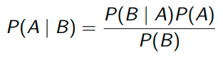

# Bayes' rule
Bayes' rule for two discrete events A and B:
  

Bayes' rule for probability distributions:

theta = parameter we're trying to estimate

Put in words:
*Posterior p() = (Likelihood x Prior)/Marginal Likelihood*

- Posterior: probability distribution of the parameters conditional on the data
- Likelihood (see ch. 1): Probability mass functions PMF (discrete) or probability density functions PDF (continuous)
  - PMF and PDF = "functions that assign probabilities or relative frequencies to all events in a sample space" - written as f(x)
- Prior: initial probability distribution (*before* seeing the data)
- Marginal likelihood (= the constant. Denominator in the formula): standardises the posterior distribution to ensure that the area under the curve of the distribution sums up to 1 -> is a valid probability distribution

Two elements:
  - kernel/core part of distribution - determines shape of distribution & is the more important part
  - constant: to ensure area under curve sums up to 1 -> is a valid probability distribution

Without the constant:
Posterior proportional to Likelihood x Prior (i.e. the product of Likelihood and Prior)


## Example 1: Binomial Likelihood, Beta prior, Beta posterior

### The data & likelihood function
100 trials, yes/no questions, 46 correct answers

Likelihood function:
Probability mass function for binomial case
```{r}
theta <- seq(0, 1, by = 0.01)

lik <- dbinom(46, 100, theta)

plot(theta, lik, type = "l")
```
Theta can range from 0 to 1 (x-axis)
Maximum likelihood estimate (highest point) at 0.46 because 46/100 = 0.46

### The prior
Beta distribution is commonly used as prior for proportions
Takes two parameters, a and b (shape1 and shape2 in R)
a and b are "hyperparameters"
a = successes, b = failures
a + b = total number of trials
Beta distribution is conjugate to the binomial density = the two densities have similar functional forms


To recreate this:
```{r}
#dbeta(x, shape1, shape2)

plot(dbeta(theta, 1, 1), type = "l") # a=b=1 - uniform prior/uninformative prior/non-informative prior

plot(dbeta(theta, 3, 3), type = "l")
plot(dbeta(theta, 16, 16), type = "l") # larger numbers = narrower distribution = more certainty

plot(dbeta(theta, 2, 6), type = "l")
plot(dbeta(theta, 6, 2), type = "l") # a != b skews the distribution
```

If a = b: theta believed to be 0.5
If a != b: theta shifts higher/lower, towards success/failure

### Computing the posterior
Posterior = compromise prior & data

Given a Binomial(n,k|theta) likelihood and a Beta(a, b) prior on theta, the posterior will be Beta(a* = a + k, b* = b + n - k)

k = successes
n = total number of trials
a & b = parameters of Beta distribution (selected prior)

Our data: 100 trials, 46 correct answers

Posterior = Beta(a + 46, b + 100 - 46)
= Beta(a + 46, b + 54)

Plugging in a prior, e.g. Beta(2, 2)
Posterior = Beta(2 + 46, 2 + 54)
= Beta(48, 56)

```{r}
# Prior:
plot(dbeta(theta, 2, 2), type = "l")

# Data:
plot(theta, lik, type = "l")

# Posterior:
plot(dbeta(theta, 48, 56), type = "l")
```

### Playing around with different priors
...and now with a stronger prior, e.g. Beta(14, 14)
Posterior = Beta(60, 68)
```{r}
# Prior:
plot(dbeta(theta, 14, 14), type = "l")

# Data:
plot(theta, lik, type = "l")

# Posterior:
plot(dbeta(theta, 60, 68), type = "l")
```

Another example: What if the prior says lower values are more likely?
= Beta(4 + 46, 14 + 54)
```{r}
# Prior:
plot(dbeta(theta, 4, 14), type = "l")

theta_ <- theta * 10
# Data:
plot(theta_, lik, type = "l")

# Posterior:
plot(dbeta(theta, 50, 68), type = "l")
```


#### 95% credible interval
95% credible interval: 95% certain that parameter value lies in it
```{r}
qbeta(c(0.025, 0.975), shape1 = 4, shape2 = 4) # a = 4, b = 4
qbeta(c(0.025, 0.975), shape1 = 10, shape2 = 10) # a = 10, b = 10
```


#### Conjugate analysis
"conjugate analysis": the posterior on the parameter has same form/same PDF as prior
specifically: Beta-Binomial conjugate case


## Example 2: Poisson Likelihood, Gamma prior, Gamma posterior

### The data and likelihood function
How often do speakers use "the" per day?

Instances of "the" produced:
day 1/x1: 115
day 2/x2: 97
day 3/x3: 79
day 4/x4: 131

Four days in total
422 "the"s in total

Count data, so poisson distribution

### The prior

prior mean of theta: 100
prior variance: 225

Fit gamma density prior for theta
Gamma has parameters a and b
Mean and variance define that function
mean = a/b
variance = a/b^2

a = mean * b
(mean * b)/b^2 = variance
mean/b = variance

->
b = mean/variance
a = mean * (mean/variance)

So for our data:
b = 100/225 ~ 0.444444
a = 100 * 100/225 = 10000/225 ~ 44.44444

```{r}
a = 10000/225
b = 100/225

plot(dgamma(seq(0, 200, by = 0.1), a, b), type = "l")
```

### Computing the posterior

Reminder:
Instances of "the" produced (x): 115, 97, 79, 131
sum(x) = 422
n = 4

Posterior:
Gamma(a* = a + sum(x), b* = b + n)
= Gamma(10000/225 + 422, 100/225 + 4)
= Gamma(466.44, 4.44)

```{r}
plot(dgamma(seq(0, 200, by = 0.1), 466.44, 4.44), type = "l")
```

### Figuring out mean and variance

...of the posterior:
mean = a*/b* = 104.95
variance = a*/b*^2 = 23.66

Mean of posterior (104.95) is a weighted mean of prior (100) and likelihood (105.5)


## Posterior as a compromise between prior and likelihood


Example from slides: Prior centered around 0.4
Likelihood (results from your experiment) around 0.75
Posterior between the two: 0.55ish

The greater the certainty in the prior, the more heavily the posterior will be influenced by the prior mean
And conversely: the greater the uncertainty in the prior, the more heavily the posterior will be influenced by the likelihood

Increasing the sample size: with large sample sizes, posterior mean influenced mostly by the sample mean

If n is very large, posterior mean will approach sample mean
As n approaches infinity, posterior variance approaches 0 -> reduces variance, posterior distribution gets tighter and tighter
-> in those cases, basically no difference between Bayesian and frequentist analysis!


Incremental knowledge gain and priors: Posterior we calculated of Beta(84, 24) could be used as prior when replicating study


# Exercises

## 1

We've conducted an experiment with 240 people. They were asked to tell us if they prefer cats or dogs. 188 people named the correct answer (cats).

What's the likelihood function? Plot it.
```{r}
plot(theta, dbinom(188, 240, theta), type = "l")
```

Apparently, previous studies were all conducted by dog fans, because they found a slight preference for dogs. What might be an appropriate prior, if we assume that those studies were low quality?

Beta(a = 4, b = 6)
```{r}
plot(dbeta(theta, 4, 6), type = "l")
```

With this prior, calculate the posterior distribution and visualise it.
Beta(a* = a + k, b* = b + n - k)
Beta(4 + 188, 6 + 240 - 188)
Beta(192, 58)
```{r}
plot(dbeta(theta, 192, 58), type = "l")
```

Now, let's assume that we found new strong evidence that people are typically split evenly on this question. How would that change our posterior?
Beta(150, 150)
```{r}
plot(dbeta(theta, 150, 150), type = "l")
```

Beta(a* = a + k, b* = b + n - k)
Beta(a* = 150 + 188, b* = 150 + 240 - 188)
Beta(338, 202)
```{r}
plot(dbeta(theta, 338, 202), type = "l")
```


## 2

I've kept count of how often the participants of this group sigh during our meetings:
25, 14, 28, 10, 35, 32

Previous research puts the sigh rate during stats classes as:
mean = 33
variance = 8

From these values, calculate a gamma distribution for the prior:
b = mean/variance
a = mean * (mean/variance)
```{r}
b <- 33/8
a <- 33 * (33/8)

plot(dgamma(seq(0, 50, by = 1), a, b), type = "l")
```

...then calculate the gamma distribution of the posterior.
Gamma(a* = a + sum(x), b* = b + n)

25, 14, 28, 10, 35, 32
n = 6
sum = 144

Gamma(a + 144, b + 6)
Gamma(280.125, 10.125)
```{r}
sum(c(25, 14, 28, 10, 35, 32))
a + 144
b + 6

plot(dgamma(seq(0, 50, by = 1), 280.125, 10.125), type = "l")
```

Finally, calculate the mean and variance of the posterior.
mean = a*/b*
variance = a*/b*^2

280.125, 10.125
```{r}
280.125/10.125
280.125/10.125^2
```

mean = 27.6
var = 2.73

Mean of our data:
```{r}
mean(c(25, 14, 28, 10, 35, 32))
```

So once again, the posterior mean (27.6) is a compromise between the mean in our data (24) and the prior mean (33)
