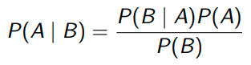
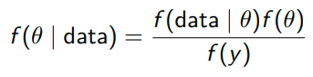
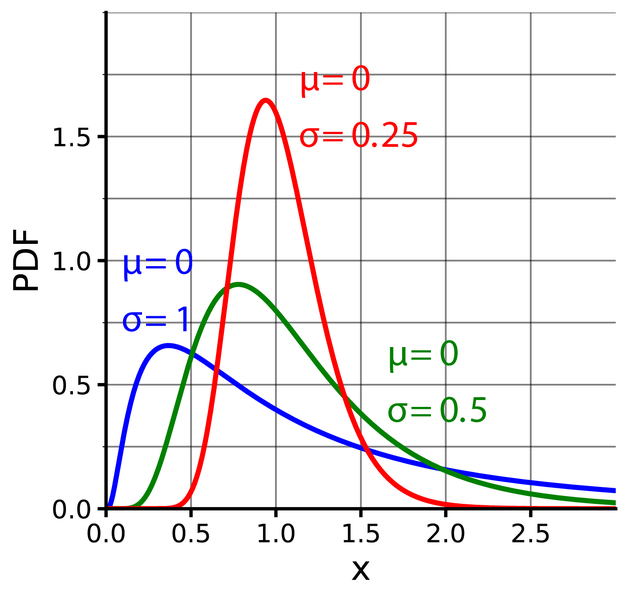

**Preparation**
Install the {brms} package

```{r}
library(tidyverse)
reading_df <- datE_stops

reading_df <- reading_df %>% 
  mutate(VOT = VOT + 200,
         item = as.factor(as.numeric(as.factor(item)))
         ) %>% 
  rename(participant = subject,
         condition = genderfact,
         rt = VOT) %>% 
  select(participant, item, condition, rt) %>% 
  mutate(across(-rt, as.factor))

reading_df <- reading_df %>%
  mutate(condition = fct_recode(condition,
                                "no training" = "f",
                                "training" = "m"))

write_csv(reading_df, "data/reading_data.csv")
```


# Theory

## Main steps of Bayesian data analysis
(1) Prior knowledge about the parameters (i.e., likely values for intercept, slopes, etc. of the model)
(2) Likelihood function - your data
(3) Posterior distribution: Updated knowledge - compromise between the prior and the data


## Quick history lesson
- Bayesian analysis as a concept is old: basics first described in 1763
- Bayes' theorem published in 1825
- computationally expensive -> became more popular recently, with increase in computing power and appearance of suitable programming languages

## Maths lesson: Probability distributions
- distributions tell us which values are possible for a certain parameter/variable
- and how are these values distributed: which values are more or less likely
-> probability of occurrence of different outcomes: how likely are data points in different ranges?

### Examples
- Which outcomes are possible when throwing a coin? How likely are they each?
- Which outcomes are possible when throwing a six-sided die? How likely are they each?
- Which values are possible when counting the number of pets in each household? Which values are most likely?
- Which values are possible when recording reading times?


### Some common distributions
Continuous:
- *Uniform distribution*: equal probability for any value in range
  - examples: dice rolls, coin throws
  - can be for continuous or discrete data
- *"Normal" (Gaussian) distribution*
  - looks like a "bell curve"
  - continuous data
  - centered on the mean, symmetric on both sides of the mean
  - most data lies closely to the mean
  - parameters: mean and standard deviation
  - typical data: reaction times, reading times (SPR), scores on e.g. test (if measured in a continuous way)
  
Discrete:
- *Bernoulli distribution*
  - two options (true/false, success/failure)
  - typical data: choice between variants (e.g. constructions, words, pronunciation options...)
  - but in contrast to data from a uniform distribution (coin throws), the two options don't have the same probability
- *Poisson distribution*
  - number of discrete events
  - typical data: counts (e.g. word counts, counts of discourse markers)
  - whole numbers
  - bounded by 0 -> negative values not possible
  - only one parameter called lambda

Let's explore distributions -- click on "Discrete and Continuous":
https://seeing-theory.brown.edu/probability-distributions/index.html


### Distributions in frequentist statistics
- generalised linear models: What's the distribution for data-generating process - which distribution is the dependent variable drawn from?
    - normal (Gaussian) distribution -> linear regression
    - Bernoulli distribution -> logistic regression
    - Poisson distribution -> Poisson regression
- this is also relevant for Bayesian models, but we additionally need to think about distributions for the priors


## Bayes' rule

Bayes' rule for two discrete events A and B:
  

Bayes' rule for probability distributions:


theta = parameter we're trying to estimate

Put in words:
*Posterior p() = (Likelihood x Prior)/Marginal Likelihood*

- Posterior: probability distribution of the parameters conditional on the data
- Likelihood = functions that assign probabilities or relative frequencies to all events in a sample space, written as f(x)
- Prior: initial probability distribution (*before* seeing the data)
- Marginal likelihood (= the constant, the denominator in the formula): standardises the posterior distribution to ensure that the area under the curve of the distribution sums up to 1 -> is a valid probability distribution

Without the constant:
Posterior proportional to Likelihood x Prior (i.e. the product of Likelihood and Prior)


### Examples for different priors


Takeaways:
(1) The posterior is a compromise between the prior and the likelihood
(2) Priors are more influential with smaller data sets (relative to how complex the model structure is)


## Types of priors

### Flat, uninformative priors
- choosing as uninformative priors as possible to 'let the data speak for itself' (uniform distribution)
- but:
  - are unrealistic (equal weight to any value)
  - make sampling slower -> might lead to convergence problems

### Regularizing priors
- priors that downweight extreme values
- not very informative, mostly letting the likelihood dominate in determining the posteriors
- also called weakly informative/mildly informative priors
- incorporate mild scepticism
- are theory-neutral: they usually do not bias the parameters to values supported by any prior belief or theory
- help stabilize computation
- especially important for small sample sizes to prevent overfitting (= model doesn't generalise well to new data)

### Principled priors
- encode all (or most of) the theory-neutral information that we do have

### Informative priors
- lots of prior knowledge and not much data
- we don’t want our priors to have too much influence on our posterior


## Sensitivity analysis

= settling on a prior that makes sense for the data, but the model should be re-run with different priors to see if any of them change the model output
- with lots of data, likelihood will dominate in determining the posterior distributions
- more complex models require more data
- sensitivity analysis useful to determine the extent to which the posterior is influenced by our priors
  - try different priors and either
    - verify that the posterior doesn’t change drastically
    - report how the posterior is affected by some specific priors


## Deriving the posterior through sampling

- For simple problems, we can calculate the posterior
- But this is not realistic for most real data analyses
- Different sampling algorithms are available
- A commonly used one is Hamiltonian Monte Carlo

Sampling and convergence in a nutshell
- Aim: to approach the posterior distribution
- Uses several chains which are independent of each other
- Chains start in random locations
- In each iteration, they each take one sample
- Samples at the beginning do not belong to the posterior distribution and are discarded (warm-up)
- Eventually, the chains end up in the vicinity of the posterior distribution
- From that point on the samples will belong to the posterior
- Given enough samples we will have a good approximation of the real posterior distribution 

Commonly used analogy:
- Several blindfolded wanderers (= chains) start in different locations in a desert and each try to find the highest peak (= posterior distribution)
- They take steps (= iterations) to find the highest spot
- At first, they are lost and wandering aimlessly (= warm-up)
- But after a while, they start to approach the peak (so these are the steps/iterations we keep)
- A map (= prior information) can help them know where to start looking for the peak
- All wanderers should get close to the peak - if they end up in different spots (= the chains aren't mixing) we can't be sure we found the highest peak (= the estimate of the posterior is likely unreliable)


## Model formula
- similar to fitting frequentist models 
  - notation: dep_var ~ 1 + ind_var
  - interactions with * and/or :
  - random effects
  - family argument (which distribution is the dependent variable drawn from)
- additional arguments
  - prior (if not specified, brms will pick priors)
  - chains (refers to the number of independent runs for sampling - default 4, should be at least 3)
  - iter (number of iterations that the sampler makes to sample from the posterior distribution of each parameter - default 2000)
  - warmup (number of iterations from the start of sampling that are eventually discarded - default half of iter)


# Demonstration

## Software and packages
```{r}
# Packages

library(tidyverse) # make sure to load these in the correct order!
library(brms) #allows us to use the Stan programming language without having to learn it
library(tidybayes)

# Settings

# to speed up modeling time, tell R to use several of your PC's cores
parallel::detectCores() # how many cores does your PC have?
options(mc.cores = 3) # how many should be used?

# set a seed for reproducibility
set.seed(2023)
```


## Example 1: Reading data

### Background and data
```{r}
reading_df <- read_csv("data/reading_data.csv") %>% 
  mutate(across(-rt, as.factor))

sample_n(reading_df, 20)
```

Research question: Are participants who received training faster than those who did not receive training?
```{r}
reading_df %>% 
  count(participant)

reading_df %>% 
  count(condition, participant) # condition is between-subject

reading_df %>% 
  group_by(condition) %>% 
  summarise(mean(rt))
```


### Setting up the model
- model with brms default priors first (not recommended)
```{r}
reading_mdl_def <- brm(rt ~ condition + 
                         (1 + condition|item) +    
                         (1|participant),
  family = gaussian(),
  data = reading_df,
  iter = 4000,
  warmup = 2000,
  chains = 3
)

#save(reading_mdl_def, file = "models/reading_mdl_def.RData")
load("models/reading_mdl_def.RData")
```


#### Convergence diagnostics
- check the model to see if it converged
- Rhat: ratio approximately 1 when within- and between-variability of the chains is roughly the same -> they converge
- Bulk_ESS: should be larger than 10% of total number of samples

```{r}
reading_mdl_def
```

Visual inspection:
- for each parameter, we see
  - left: a density plot of the estimate
  - right: the chains and whether they mixed (caterpillar plots)
    -> did they find the same/a very similar solution?
    if not, model not reliable
```{r}
plot(reading_mdl_def)
```


Which priors did brms pick?
```{r}
prior_summary(reading_mdl_def)
```
- lists all parameters in the model which need priors and their priors
  - intercept and slopes (class = b)
  - sigma (error)
  - mixed effects models: intercept adjustments with sd, slope adjustments with sd, correlation parameter
- tells us the distribution with parameters for each prior
  - Student t-distribution for the intercept and random effects
    - looks similar to the normal distribution, but heavier tails
    - centered on 0
  - flat priors for the slopes -> any value equally likely (but this is not realistic!)
-> brms picks sensible regularising priors, taking into account link functions and the scale of the data
-> but we should still set our own priors, especially for the slopes


### Bodo Winter's approach to prior selection
- use default priors on all parameters except coefficients
- use weakly informative priors on coefficients to incorporate "mild skepticism"/make model more conservative than models with uniform priors/frequentist models
- typically use a normal distribution
-> centre prior on 0 and choose SD that makes sense for the scale of the data and the link function
- for SD: think about where 68%/95% of the data fall
-> 68% of data fall one standard deviation to either side of mean
  95% of data within two standard deviations
e.g., mean = 0, SD = 0.5 -> 68% within -0.5 and 0.5
  95% of data within -1 and 1

```{r}
prior_p <- ggplot(data = tibble(x = c(-5, 5)), aes(x = x)) +
  stat_function(fun = dnorm, n = 101,
                args = list(mean = 0, sd = 1),
                aes(color = 'red'), size = 1.15) +
  stat_function(fun = dnorm, n = 101,
                args = list(mean = 0, sd = 0.5), linetype = 2,
                aes(color = 'blue'), size = 0.65) +
  stat_function(fun = dnorm, n = 101,
                args = list(mean = 0, sd = 2), linetype = 3,
                aes(color = 'black'), size = 1.15) +
  scale_color_manual(values = c('red', 'blue', 'black'),
                     name = 'Standard deviation',
                     breaks = c('red', 'blue', 'black'),
                     labels = c('SD = 1', 'SD = 0.5', 'SD = 2')) +
  scale_x_continuous(breaks = -4:4) +
  scale_y_continuous(name = 'Probability density', expand = c(0, 0)) +
  theme_classic() +
  theme(panel.grid.major = element_blank(),
        panel.grid.minor = element_blank(),
        axis.text.x = element_text(size = 8),
        axis.text.y = element_text(size = 8),
        axis.title.y = element_text(face = 'bold', size = 10,
                                    margin = margin(r = 15, l = 0,
                                                    t = 0, b = 0)),
        axis.title.x = element_text(face = 'bold', size = 10,
                                    margin = margin(r = 0, l = 0,
                                                    t = 15, b = 0))) +
  coord_cartesian(ylim = c(0, 0.8)) +
  xlab('Possible slope values')
```

```{r}
prior_p
```


### Priors
Domain knowledge: What's a sensible difference in reading times between words?

```{r}
sceptical_priors <- c(prior(normal(0, 50), class = b))
```
What values are within 95% of the probability distribution of normal(0, 50)?

Rerunning the model with those priors:
```{r}
reading_mdl_reg <- brm(rt ~ condition + 
                         (1 + condition|item) +    
                         (1|participant),
  family = gaussian(),
  data = reading_df,
  prior = sceptical_priors,
  iter = 4000,
  warmup = 2000,
  chains = 3
)

#save(reading_mdl_reg, file = "models/reading_mdl_reg.RData")
load("models/reading_mdl_reg.RData")
```

...and re-checking:
```{r}
reading_mdl_reg
plot(reading_mdl_reg)
```


### Posterior predictive checks
= sample n data sets generated from the model (which incorporated the likelihood and priors)
- generate n posterior distributions and compare them to the actual distribution
-> "descriptive adequacy" of the model
- a model should not only fit the data well
- the range of its predictions should also be reasonably constrained
- posterior predictive checking plots observed and predicted data
- can also help determine which distribution (family argument) is better fit for the data
```{r}
pp_check(reading_mdl_reg, ndraws = 100)
```

Interpretation:
- dark blue line is a density plot of the observed data
- thinner light blue lines are samples drawn from the posterior (reminder: compromise prior and data)
- should be fairly close together
- dark blue line should fall within the light blue lines
-> data and samples should be fairly similar


### Model output
```{r}
contrasts(reading_df$condition)
```
-> "no training" is the reference level (model intercept)
-> slope will show the change in reading times to the training condition

```{r}
plot(reading_mdl_reg)
```
- each parameter is represented by a density plot
- it shows which values are most likely

```{r}
reading_mdl_reg
```
- the model summary shows the likeliest value for each parameter (MLE)
  - random effects = group-level effects
  - fixed effects = population-level effects
- along with the 95% credible (not confidence) intervals
  - derived from these plots
  - interpretation: we can be 95% certain that the true parameter value is between those two points, given the data and model
  - cf. confidence intervals: if we draw from the same population 100 times, then 95 times the CI will contain the true population value
  
Specifically for this model:
- 95% certain that reading times in no training condition are between 275.31 and 295.74
- slope is likely negative -> participants who had training read more quickly
- 95% certain that slope is between -19.52 and 5.78

Visualisation of model output:
```{r}
mcmc_plot(reading_mdl_reg)
mcmc_plot(reading_mdl_reg, type = "hist")
mcmc_plot(reading_mdl_reg, variable = "^b_", regex = TRUE)
```
- dot shows most likely estimate
- thicker line: 80% credible interval
- thinner line: 95% credible interval


### Model predictions
We can plot the model predictions (with 95% credible intervals):
```{r}
conditional_effects(reading_mdl_reg)
```


### Bayes factors
Bayes factor: ratio of the likelihoods of the two models under comparison
more complex model vs. null model

BF = 10-30 support for more complex model
BF = 3-10 weaker support for complex model
BF close to 1 no model seems to be better than the other
BF below 0.1 support for simpler model


### Hypothesis testing
- we can calculate probabilities for or against hypotheses
-> one of the advantages of Bayesian models

For example: Is the slope for condition negative?
```{r}
hypothesis(reading_mdl_reg, "conditiontraining < 0")
```


### Picking a different distribution
- reading times are often better described by a log-normal distribution
- they can't be negative
- often have a long tail (more high values)
- are often log-transformed before modeling, but we can also pick a different family argument

```{r}

```


Model with log-normal instead of normal distribution and adjusted prior:
```{r}
reading_mdl_ln <- brm(rt ~ condition + 
                         (1 + condition|item) +    
                         (1|participant),
  family = lognormal(),
  data = reading_df,
  prior = prior(normal(0, 5), class = "b"),
  iter = 4000,
  warmup = 2000,
  chains = 3
)

#save(reading_mdl_ln, file = "models/reading_mdl_ln.RData")
load("models/reading_mdl_ln.RData")
```


```{r}
plot(reading_mdl_ln)
reading_mdl_ln
```
- the estimates need to be exponentiated to transform them back to reading times
```{r}
exp(5.65) # intercept: no training condition
exp(5.65 - 0.02) # intercept + slope: training condition
```

The conditional effects plot does this automatically:
```{r}
conditional_effects(reading_mdl_ln)
```

We can compare the posterior predictive checks to see which model is a better choice:
```{r}
pp_check(reading_mdl_reg, ndraws = 100)
pp_check(reading_mdl_ln, ndraws = 100)
```


### Model comparison

#### ...using Bayes factors


#### ...using leave-one-out cross-validation


## Example 2: Direction of gestures

### Background and data
From a tutorial taught by Bodo Winter, with data from Winter & Duffy (2020), 'Can co-speech gesture alone carry the mental timeline?'

Participants were asked the following question:
"Next Wednesday's meeting has been moved **forward/backward** two days, what day is the meeting on now?"
-> roughly 50%/50% split between Friday and Monday

Can gestures modulate the interpretation?
- hands moving towards body -> more Monday responses?
- hands moving away from body -> more Friday responses?
2x2 design: "forward"/"backward" x gesture towards/away from body

Research questions:
- Is there an interaction between verbal and non-verbal directions?
- Which effect is stronger - language or gesture?

```{r}
E3 <- read_csv("data/direction_gestures.csv")

# Factor conversion, releveling
E3 <- E3 %>% 
  mutate(
    across(c(language, direction), as_factor),
    response = factor(response, levels = c('Monday', 'Friday')),
  )

# Sum-coding
contrasts(E3$language) <- contr.sum(2) / 2 * -1
contrasts(E3$direction) <- contr.sum(2) / 2 * -1

sample_n(E3, 10)
```


### Setting up the model

#### Default priors
```{r}
E3_mdl_default <- brm(response ~ direction * language,
                      data = E3,
                      family = bernoulli, # logistic regression
                      chains = 3,
                      warmup = 2000,
                      iter = 4000
                      )

#save(E3_mdl_default, file = 'models/E3_mdl_default.RData')
load(file = 'models/E3_mdl_default.RData')
```

Checking model convergence:
```{r}
plot(E3_mdl_default)
```
The chains haven't mixed!

```{r}
prior_summary(E3_mdl_default)
```
The default priors are flat (= uniform distribution)


#### Regularizing priors
- same approach as in example 1, but because of the link function, the estimates will be smaller
- priors should reflect that
```{r}
regularizing_priors <- c(prior(normal(0, 1), class = b))

E3_mdl_reg <- brm(response ~ direction * language,
                      data = E3,
                      family = bernoulli, # logistic regression
                      prior = regularizing_priors,
                      chains = 3,
                      warmup = 2000,
                      iter = 4000
                      )

#save(E3_mdl_reg, file = 'models/E3_mdl_reg.RData')
load(file = 'models/E3_mdl_reg.RData')
```

```{r}
plot(E3_mdl_reg)
```
The chains have mixed

```{r}
prior_summary(E3_mdl_reg)
```


### Model output

Reminder:
- "Next Wednesday's meeting has been moved **forward/backward** two days, what day is the meeting on now?"
- direction of gesture: forward or backward
- "Monday" is the reference level, so this predicts "Friday" responses

```{r}
contrasts(E3$direction)
contrasts(E3$language)

E3_mdl_reg
```
Slopes:
- positive slope for direction
-> more Friday responses with forward gesture
- positive slope for language
-> more Friday responses with forward language


### Plotting predicted values
```{r}
conditional_effects(E3_mdl_reg,
                    effects = 'language:direction')
```
- "moved backward" + backward gesture: low predicted proportion of "Friday" responses, small CI -> interpreted as Monday
- "moved backward" + forward gesture: still fairly low predicted proportion of "Friday" responses, but lower than previous condition, and larger CI -> interpreted mostly as Monday
- "moved forward" + backward gesture: slightly higher predicted proportion of "Friday" responses, but still lower than 0.5, and large CI -> still mostly Monday responses
- "moved forward" + forward gesture: highest predicted proportion of "Friday" responses, but not as strong as backward + backward for Monday -> mostly interpreted as Friday


### Testing hypotheses

Is the slope for language positive?
```{r}
hypothesis(E3_mdl_reg, 'language1 > 0')
```

Is the slope for direction positive?
```{r}
hypothesis(E3_mdl_reg, 'direction1 > 0')
```

Is the interaction slope negative?
```{r}
hypothesis(E3_mdl_reg, 'direction1:language1 < 0')
```

Is the effect of language stronger than that of direction?
```{r}
hypothesis(E3_mdl_reg, 'language1 > direction1')
```

Is the effect of the interaction stronger than either of the main effects?
```{r}
hypothesis(E3_mdl_reg, 'direction1:language1 > direction1')
hypothesis(E3_mdl_reg, 'direction1:language1 > language1')
```


### Posterior predictive checks

Check posterior predictive simulations:
```{r}
pp_check(E3_mdl_reg, ndraws = 100)
```


# Comparing Frequentist and Bayesian approaches

## Advantages of Bayesian models
- ability to incorporate prior information
  - if strong previous evidence
  - but even if no (convincing) previous evidence, non-informative priors can help fit a model more quickly/ability to fit more complex structure than corresponding frequentist model could
- more flexible model specification (different distributions, can specify if distributions are truncated)
- generate estimates and credible intervals
  - credible intervals are easier to interpret/more intuitive than confidence intervals (and p-values)
  - allow us to draw fine-grained conclusions rather than being forced into a binary decision (p < 0.05 or not?)
- calculate predictions based on the posterior distribution
- computationally robust
- credible intervals not dependent on large-N approximations
- able to quantify support for or against null hypothesis  

## Issues with Bayesian models
- arguably more intuitive to interpret, but harder to fit?
- prior selection can strongly influence models and Bayes factors, especially with small Ns


